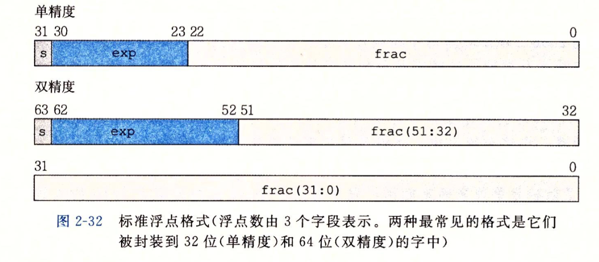
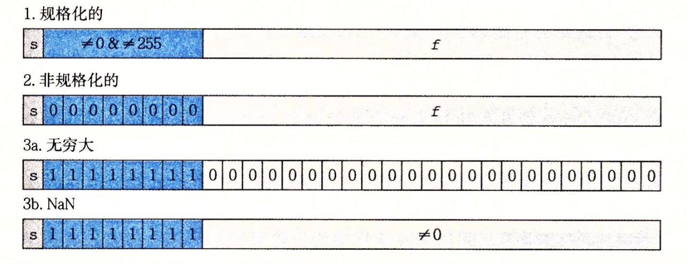

# 数字表示

### 浮点数
国际上采用IEEE754标准，具体如下
IEEE浮点标准用V=(-1)^s x M x 2^E 形式来表示一个数：
* 符号（sign）s决定这数是负数还是正数。而对于数值0的符号位解释作为特殊情况处理
* 尾数 M是一个二进制小数，它的范围是1~ 2^-e，或者是0~1^-e。
* 阶码  E的作用是对浮点数加权，这个权重是2的E次幂。将浮点数的位表示划分为三个字段，分别对这些值进行编码。
* k位的阶码字段exp 编码阶码E
* n位小数字段frac 编码尾数M

根据exp的值，被编码的值可以分成三种不同的情况

### 舍入

